# TripleGen — Application Walkthrough


## 1. Home page

When you open the app you'll see two panels side by side.

The **left panel** is where you provide the text you want to analyse — you can paste it, upload files, or just use the built-in default paper.

The **right panel** is where you configure the run — pick a prompting method, a pipeline mode, an LLM provider, and a few optional settings.

The navigation bar at the top has three links:
- **Run experiment** — runs a single configuration (the home page).
- **Run comparison** — batch mode to compare multiple configurations at once.
- **High contrast** — accessibility toggle if you prefer a higher-contrast theme.

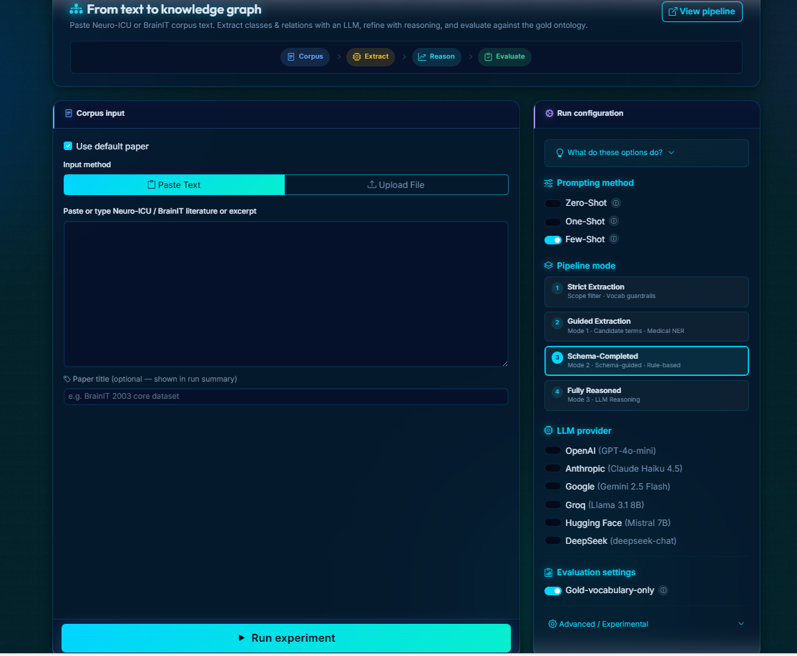

---

## 2. Running a single experiment

### 2.1 Providing input text

You have three ways to give the system something to work with.

**Option A — Paste text**

Click the **Paste Text** tab, paste or type your clinical text into the box, and optionally give it a title (e.g. "BrainIT 2003 core dataset"). The title just makes the run summary easier to read — otherwise it shows up as `corpus.txt`.

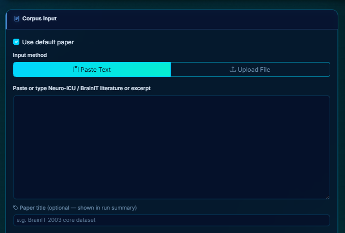

**Option B — Upload files**

Click the **Upload File** tab and drag-and-drop one or more `.txt` or `.pdf` files (up to 10 MB each). If you upload multiple files they're all combined into one corpus and processed together.

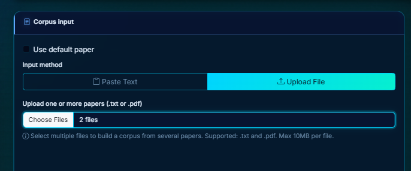

**Option C — Use the default paper**

Turn on the **Use default paper** toggle. The run uses the built-in BrainIT paper, and any text or files you've added are ignored.

---

### 2.2 Configuring the run

> At the top of the right panel, click **"What do these options do?"** to expand a short glossary. Each option also has a **ⓘ** tooltip if you hover over it.

**Prompting method**

This controls how the LLM is guided during extraction. Pick one:

| Strategy | What it does |
|----------|-------------|
| **Zero-Shot** | No examples at all — the LLM works purely from the text. This is the baseline. |
| **One-Shot** | One retrieved example is included per chunk to give the LLM a format to follow. A separate hierarchy step kicks in when the text contains obvious hierarchy cues. |
| **Few-Shot** | Three dedicated extraction phases, each with its own examples. Phase 1 extracts concepts broadly, Phase 2 picks up relations (and any concepts Phase 1 missed), and Phase 3 extracts hierarchy edges — but only when the text contains cues like "such as", "is a", or "type of". Instructions actively discourage the LLM from just copying the example content. |

**Pipeline mode**

This controls how much post-processing happens after the LLM extracts. Each mode adds a layer on top of the previous one:

| Mode | What it adds |
|------|-------------|
| **1 · Strict** | Filters extracted content by scope and vocabulary before anything else. No extra steps. |
| **2 · Guided** | Everything in Mode 1, plus medical named-entity recognition and candidate term suggestions fed into the prompt. |
| **3 · Schema-Completed** | Everything in Mode 2, plus the system compares the generated ontology against the gold schema and fills in any gaps that can be supported by the text. Rule-based reasoning also runs to tidy up the hierarchy. |
| **4 · Fully Reasoned** | Everything in Mode 3, plus a second LLM pass that proposes and verifies additional hierarchy relationships against the gold schema. |

**LLM provider**

Pick which model does the extraction:

| Provider | Model |
|----------|-------|
| **OpenAI** | GPT-4o-mini |
| **Anthropic** | Claude Haiku 4.5 |
| **Google** | Gemini 2.5 Flash |
| **Groq** | Llama 3.1 8B (free) |
| **Hugging Face** | Mistral 7B (free) |
| **DeepSeek** | deepseek-chat |

**Evaluation settings**

The **Gold-vocabulary-only** option filters the generated ontology down to the gold vocabulary before computing precision and recall. It's an evaluation control — it doesn't change what gets extracted, and the full unfiltered output is always saved alongside.

**Advanced / Experimental**

Expand this section if you want to change the reasoning LLM — the model used for schema-guided completion and the LLM reasoning layer in Modes 3 and 4. You can choose between **OpenAI GPT-4o-mini** (the default) and **DeepSeek Reasoner R1** (stronger reasoning, but slower).

If you leave this section alone, GPT-4o-mini handles both extraction and reasoning.

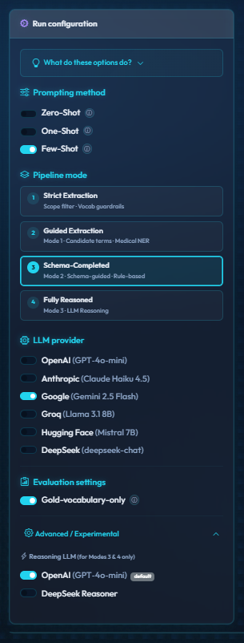

---

### 2.3 Starting the run

Once you're happy with the settings, click **Run experiment** at the bottom of the left panel. The app takes you straight to the progress page.

---

## 3. Progress page

This page updates in real time while the pipeline runs.

| Element | What it shows |
|---------|--------------|
| **Run ID** | A unique identifier for this run (`YYYYMMDD-HHMMSS-<hash>`). |
| **Status badge** | Running / Completed / Failed / Cancelled. |
| **Progress bar** | How far through the chunks the pipeline is. |
| **Progress message** | The current step, e.g. "Processing chunk 3 of 12". |
| **Live knowledge graph** | A growing visual network of the classes and relations extracted so far. |
| **Triple stream** | The latest Subject → Predicate → Object extractions shown as pills. |

If you want to stop early, click **Cancel**. A confirmation dialog appears, and if you confirm, the run stops and its files are deleted.

When the run finishes, the page automatically redirects you to the Results page.

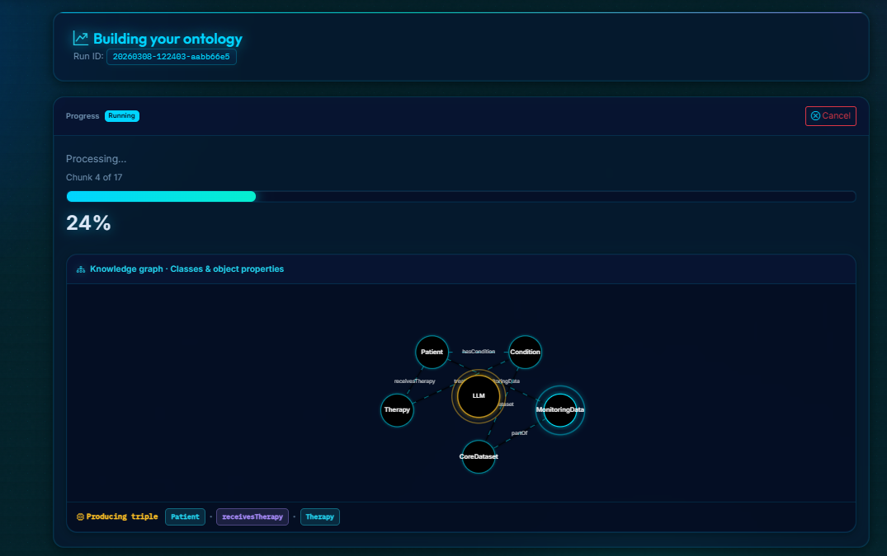

---

## 4. Results page

### 4.1 Evaluation metrics

The left card shows the full evaluation metrics as a formatted block.

| Metric group | What's included |
|---|---|
| **Class** | Coverage, precision, recall, hallucinations, schema violations, omissions. |
| **Structural** | Hierarchy edges, hierarchy coverage, relation domain/range rate. |
| **Relations** | Precision, recall, counts, and a per-relation breakdown. |
| **Clinical-only** | The same class metrics but limited to clinical vocabulary. |

Below the metrics is a **per-stage ablation table** — a compact view of how the ontology changed at each pipeline stage:

```
Stage              Classes  Rels  Hier  Coverage  Precision  Recall
──────────────────────────────────────────────────────────────────
Extraction              35     8    28    48.61%    100.00%  48.61%
+ Schema-Guided         59    22    59    79.17%    100.00%  79.17%
+ Cleanup               57    19    19    79.17%    100.00%  79.17%
+ Rule-based            57    19    41    79.17%    100.00%  79.17%
```

This makes it easy to see which stage contributed (or removed) the most.

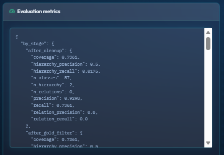

---

### 4.2 Knowledge artifacts

The right card lists everything the run produced. Click any link to view or download the file.

| Artifact | File | What it contains |
|----------|------|-----------------|
| **Ontology** | `ontology.json` | The full generated ontology — classes, relations, and hierarchy with evidence. |
| **Restricted ontology** | `ontology_restricted.json` | A copy filtered to the gold vocabulary, used for evaluation. Only produced when Gold-vocab is on. |
| **Summary** | `summary.txt` | A human-readable report covering metadata, input papers, metrics, the ablation table, and full listings. |
| **Metrics** | `metrics.json` | All metrics in structured form, including per-stage and per-relation breakdowns. |
| **Improvement counts** | `improvement_counts.json` | How many classes, relations, and hierarchy edges were added or removed at each stage. |
| **SGC diagnostic** | `sgc_diagnostic.json` | Counts from the schema-guided completion step — raw response size, items parsed, items kept. Modes 3–4 only. |
| **Prompts** | `prompt_chunk_NNNN.txt` | The exact prompt sent to the LLM for each chunk and phase. |
| **Metadata** | `metadata.json` | Run configuration, input file names, environment info, and code version. |

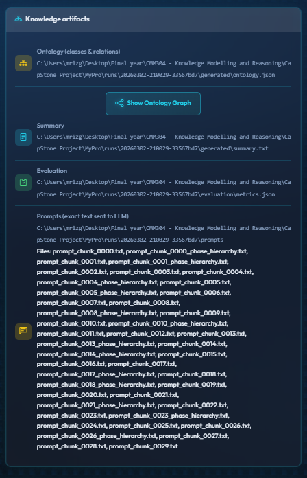

---

### 4.3 Ontology graph

If an ontology was produced, a **Show Ontology Graph** button appears near the artifacts.

1. Click **Show Ontology Graph**.
2. A full-screen interactive graph opens, powered by Cytoscape.js.

| Feature | How it works |
|---------|-------------|
| **Colour-coded nodes** | Classes are coloured by type: teal = core, amber = governance, purple = provenance, grey = inferred. |
| **Edge types** | Solid cyan edges show hierarchy (subClassOf); dashed orange edges show relations (domain → range). |
| **Click a node** | Highlights the node and its neighbours. A panel on the right shows its label, definition, parents, children, related relations, and evidence. |
| **Layout switcher** | Switch between Force (physics), Tree (hierarchical), Circle, and Grid layouts. |
| **Export** | Click **PNG** in the toolbar to save the current graph view as an image. |
| **Stats bar** | Shows the total class, relation, and hierarchy edge counts at the bottom. |

3. Click **Close** or press **Escape** to go back to the results page.

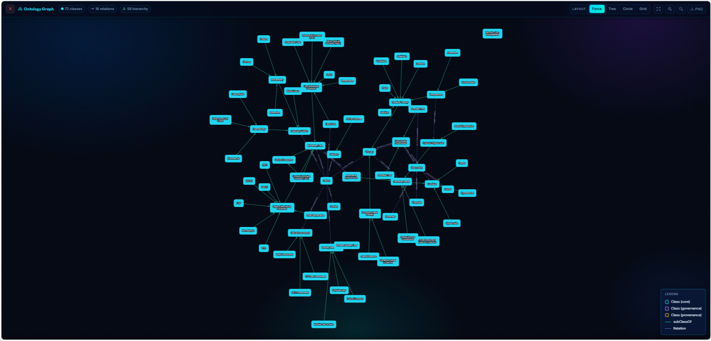

---

## 5. Running a batch comparison

Click **Run comparison** in the navigation bar. This page works the same way as the single-run home page — same corpus input on the left, same configuration panel on the right — but instead of running immediately, you build a list of configurations to run one after another.

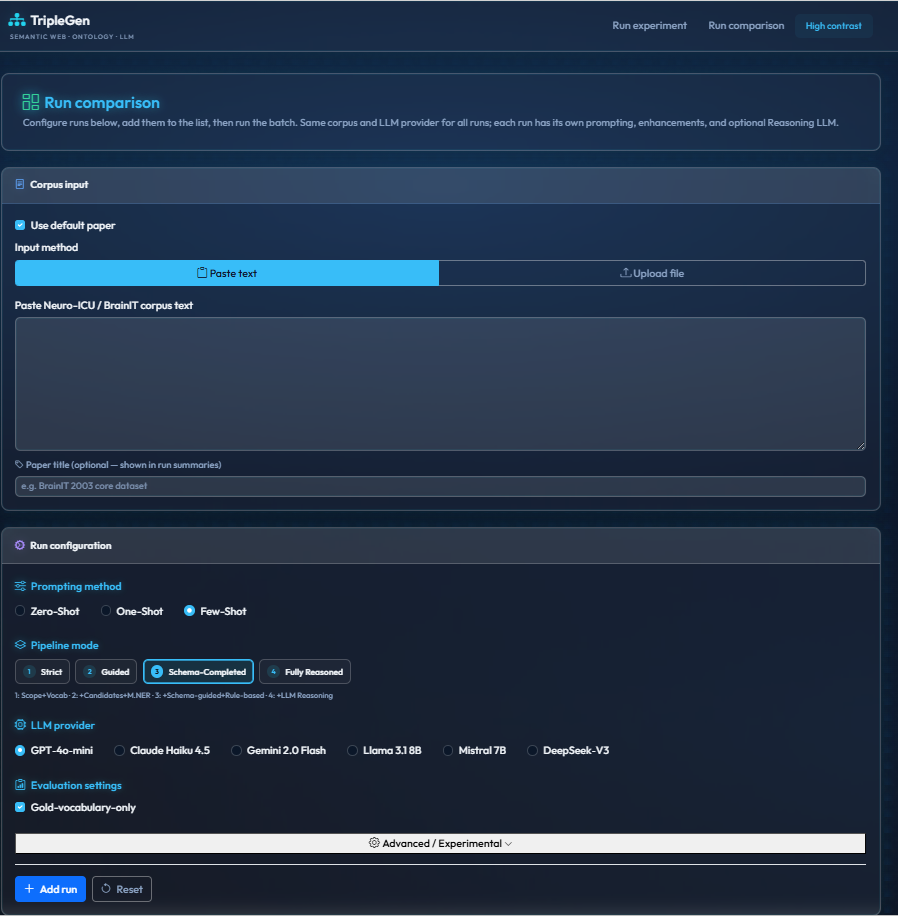

---

### 5.1 Adding runs to the batch

1. Set up a configuration using the right panel — exactly the same options as a single run.
2. Click **Add run**. It appears as a new row in the table below.
3. Change any options you like and click **Add run** again to add another configuration.
4. Use **Reset** at any point to clear all fields back to defaults before building a new entry.

---

### 5.2 The runs table

Each row in the table represents one configuration:

| Column | What it shows |
|--------|--------------|
| **Checkbox** | Select this row for running or analysis. |
| **#** | Row number. |
| **Run name** | An auto-generated label that identifies the configuration, e.g. `Few-Shot - Schema-Completed - GPT‑4o‑mini - Gold-vocab - None`. |
| **Strategy** | Zero-Shot / One-Shot / Few-Shot. |
| **Pipeline mode** | Strict / Guided / Schema-Completed / Fully Reasoned. |
| **LLM** | Provider and model. |
| **Eval settings** | Gold-vocab or None. |
| **Advanced** | DSR (DeepSeek Reasoner) or None. |
| **Actions** | View the last result, view the full analysis history, or remove the row. |

The **Select all** checkbox in the header selects or deselects everything at once. The trash icon in the Actions column removes a row.

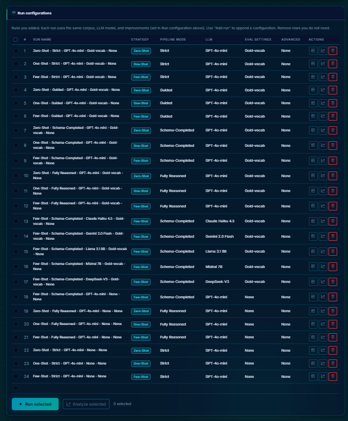

---

### 5.3 Running the batch

1. Tick the rows you want to run (or use **Select all**).
2. Click **Run selected**. The app takes you to the batch progress page.

The status bar shows how many rows are currently selected, e.g. "3 selected".

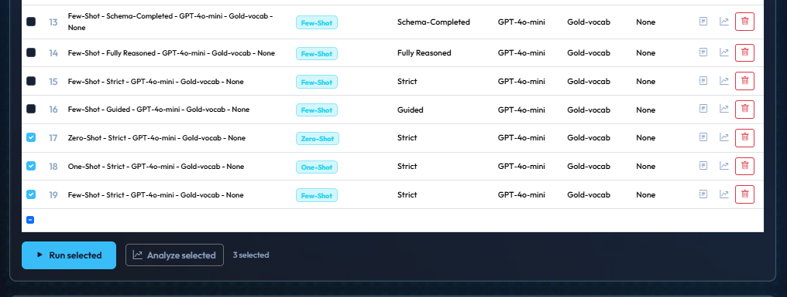

---

## 6. Batch progress page

Each configuration gets its own status row:

| Element | What it shows |
|---------|--------------|
| **Run label** | The 5-part name for this configuration. |
| **Run ID** | Assigned when the run starts. |
| **Status badge** | Pending / Running / Completed / Failed / Cancelled. |

Runs go one at a time in sequence — the current run shows live progress while the rest wait. **Cancel** stops everything that hasn't finished yet; already-completed runs are kept.

When everything is done, an **Analyze** button appears to open the batch analysis.

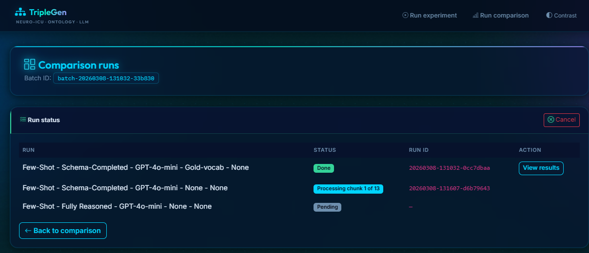

---

## 7. Comparing and analysing results

### 7.1 Analyze selected

From the **Run comparison** page (you don't need to re-run anything), tick the configurations you want to compare and click **Analyze selected**. A modal opens showing the last completed run for each configuration.

| Column | What it shows |
|--------|--------------|
| **Run** | Row label. |
| **F1** | F1 score (harmonic mean of precision and recall). |
| **Precision** | Class precision. |
| **Recall** | Class recall. |
| **Coverage** | Class coverage. |
| **View** | Opens the full Results page for that run in a new tab. |

The best-performing run (by F1) gets a "best" badge. A bar chart and a precision-vs-recall scatter plot are shown alongside the table. You can search by run name and switch between Top 10, Top 20, or All views.

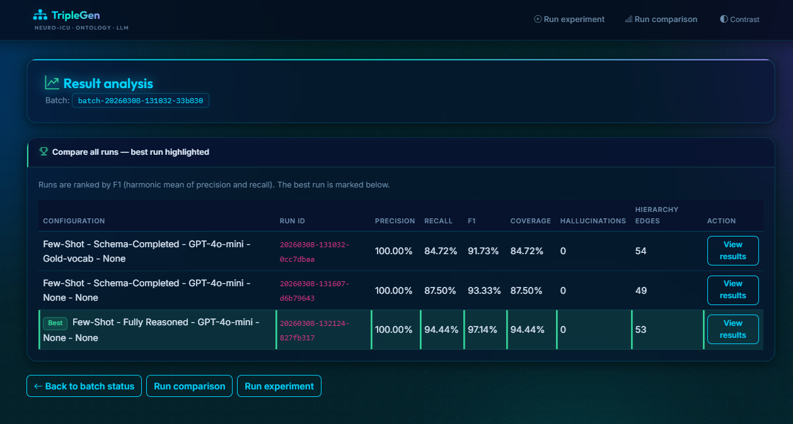

---

### 7.2 Per-run actions

In the runs table, each row has two action buttons:

| Button | What it does |
|--------|-------------|
| **Last result** (clipboard icon) | Shows a summary of the most recent completed run for this configuration. |
| **Analysis** (chart icon) | Shows metrics for every past run with this exact configuration — useful for seeing how consistent the LLM is across repeated runs. |

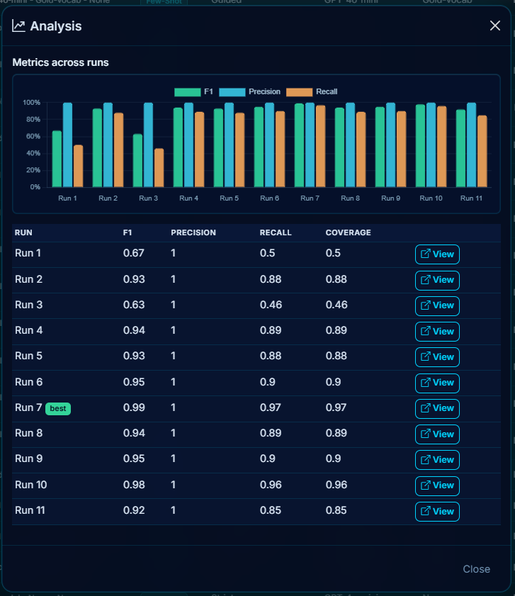

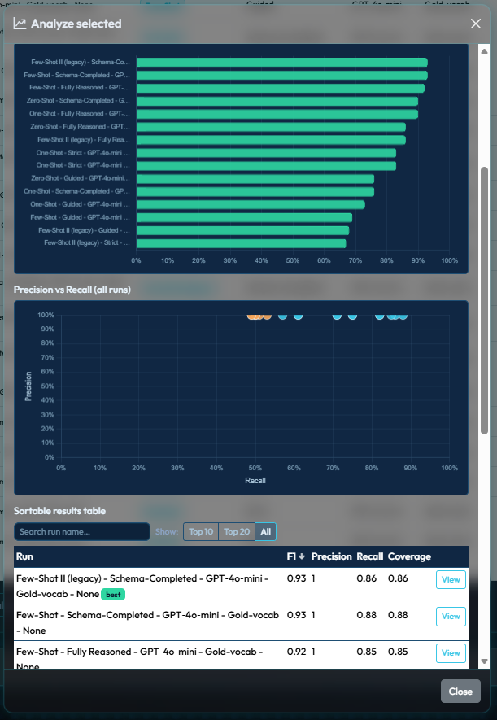

---

### 7.3 Batch analysis

After a batch finishes from the Batch progress page, click **Analyze** to see a full comparison table with metrics for every run. The best run is highlighted, and each row has a **View** link to open its Results page.

---

## 8. The summary file

Every run saves a `summary.txt` that you can open straight from the Results page. It's the easiest way to read everything in one place.

| Section | What it covers |
|---------|---------------|
| **Metadata** | Run ID, timestamp, prompting method, pipeline mode, LLM, evaluation settings. |
| **Input papers** | The filenames you provided. Pasted text shows your chosen title, or `corpus.txt` if you didn't enter one. |
| **Improvement counts** | How many classes, relations, and hierarchy edges were added, removed, or inferred at each stage. |
| **Final metrics** | Coverage, precision, recall, errors, structural metrics, clinical-only metrics, relation precision/recall. |
| **Extraction-only metrics** | The same metrics before any improvement step — your raw LLM baseline. |
| **Per-stage ablation table** | A compact table showing how the ontology changed at every stage. |
| **Concept counts** | Total classes, relations, and hierarchy edges in the final ontology. |
| **Full listings** | Every class, relation, and hierarchy edge with labels and evidence. |

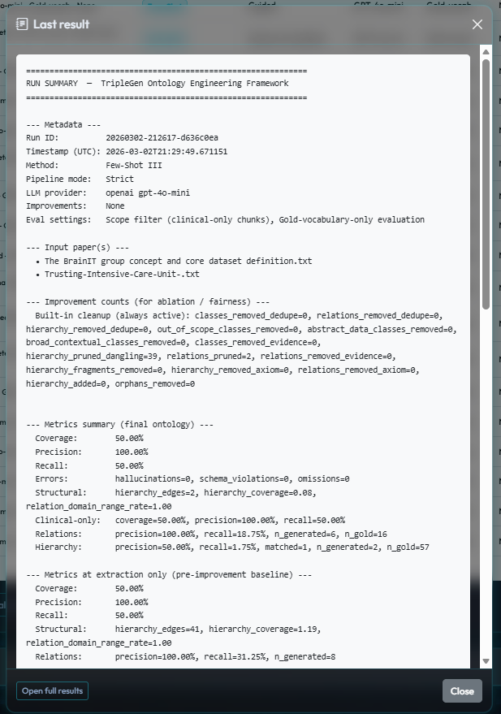

---

## 9. Run labels explained

Every run gets a 5-part label that describes its exact configuration:

```
Strategy - PipelineMode - LLM - EvalSettings - Advanced
```

**Examples:**

| Label | What it means |
|-------|--------------|
| `Few-Shot - Schema-Completed - GPT‑4o‑mini - Gold-vocab - None` | 3-phase Few-Shot extraction, Schema-Completed mode, OpenAI GPT-4o-mini, gold-vocab evaluation, no advanced options. |
| `Zero-Shot - Fully Reasoned - Anthropic - Gold-vocab - None` | Zero-Shot baseline with full post-processing, using Anthropic Claude. |
| `Few-Shot - Schema-Completed - GPT‑4o‑mini - Gold-vocab - DSR` | Few-Shot with DeepSeek Reasoner handling schema-guided completion and LLM reasoning. |

This label appears everywhere — the comparison table, run list, batch progress, summary file, and metadata.

---

## Where are my run files?

All outputs are saved under `runs/<run_id>/`:

```
runs/<run_id>/
├── metadata.json                  # Config, input papers, environment
├── generated/
│   ├── ontology.json              # Full generated ontology
│   ├── ontology_restricted.json   # Gold-filtered copy (when Gold-vocab is on)
│   └── summary.txt                # Human-readable report
├── evaluation/
│   ├── metrics.json               # All metrics (by_stage, relations, etc.)
│   ├── improvement_counts.json
│   ├── axiom_violations.json
│   └── hallucinated_classes.json
└── prompts/
    ├── prompt_chunk_0000_phase1.txt
    ├── prompt_chunk_0000_phase2.txt
    ├── sgc_prompt.txt             # Schema-guided completion prompt
    ├── sgc_response.txt           # SGC raw LLM response
    ├── sgc_diagnostic.json        # SGC parsing counts
    └── ...
```
