# TripleGen — Application Walkthrough

## How to run the app

### Prerequisites

- **Python 3.11** (or later)
- API keys for at least one LLM provider (OpenAI at minimum)

### Setup

```bash
# Create and activate a virtual environment
python -m venv .venv
source .venv/Scripts/activate   # Windows Git Bash
# .venv\Scripts\activate        # Windows CMD

# Install dependencies
pip install -r requirements.txt

# Download the spaCy English model
python -m spacy download en_core_web_sm

# Set up environment variables
cp .env.example .env
# Open .env and fill in your API keys (OPENAI_API_KEY at minimum)
```

### Start the app

```bash
python web/app.py
```

The app opens at **http://127.0.0.1:5000**.

### Browsing existing results

The `runs/` directory contains pre-computed experiment results. When you open the app, all previous runs appear in the results dropdown and on the comparison pages — no API keys are needed just to browse them.

---

## 1. Navigation

The navigation bar has five items:

| Link | What it does |
|------|-------------|
| **Run experiment** | Run a single configuration (the home page). |
| **Controlled experiment** | Fine-grained ablation with 18 individual pipeline toggles. |
| **Run comparison** | Batch mode to compare multiple configurations at once. |
| **Ontology engineering** | Cross-paper reconstruction — merge multiple prior runs, cluster the merged classes, and ask the LLM to enrich each cluster. |
| **Contrast** | Accessibility toggle for a higher-contrast theme. |

---

## 2. Home page — Run experiment

When you open the app you see two panels side by side.

The **left panel** is where you provide the text you want to analyse — you can paste it, upload files, or use the built-in default paper.

The **right panel** is where you configure the run — pick a prompting method, a pipeline mode, an LLM provider, and optional settings.

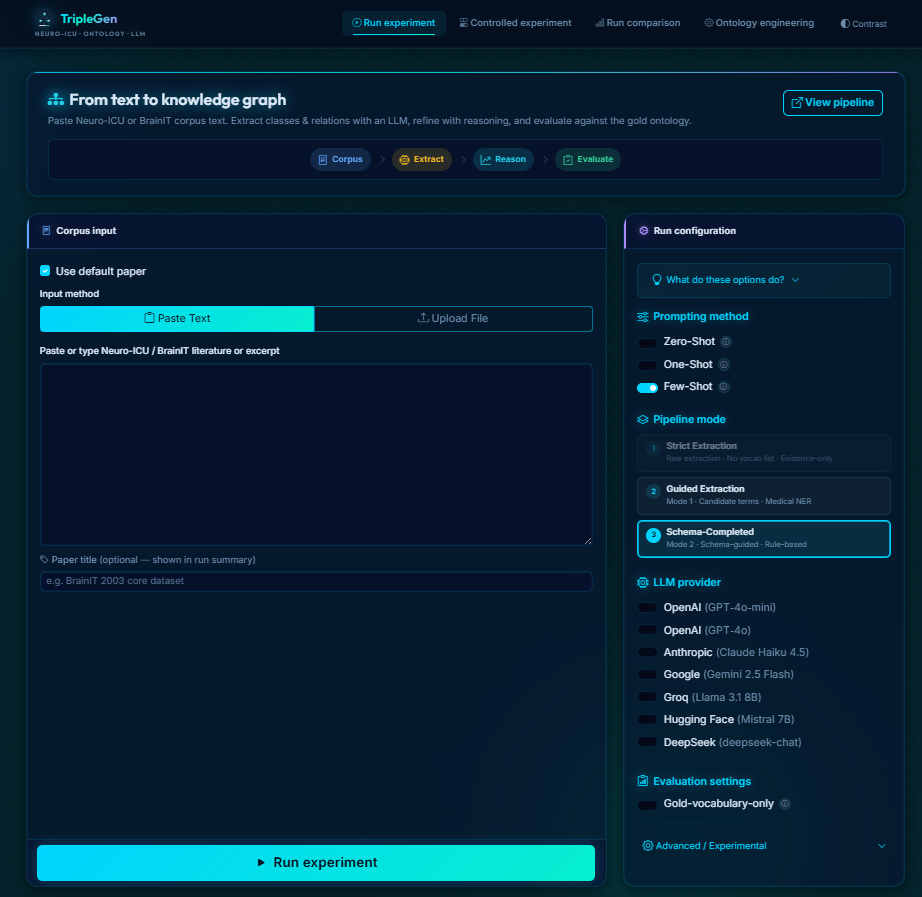

---

### 2.1 Providing input text

You have three ways to give the system something to work with.

**Option A — Paste text**

Click the **Paste Text** tab, paste or type your clinical text into the box, and optionally give it a title (e.g. "BrainIT 2003 core dataset"). The title makes the run summary easier to read — otherwise it shows up as `corpus.txt`.

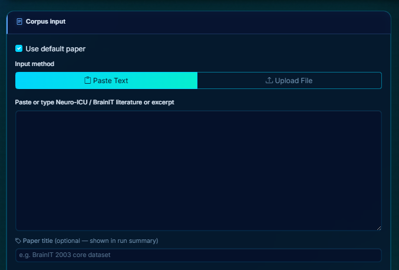

**Option B — Upload files**

Click the **Upload File** tab and drag-and-drop one or more `.txt` or `.pdf` files (up to 10 MB each). If you upload multiple files they are all combined into one corpus and processed together.

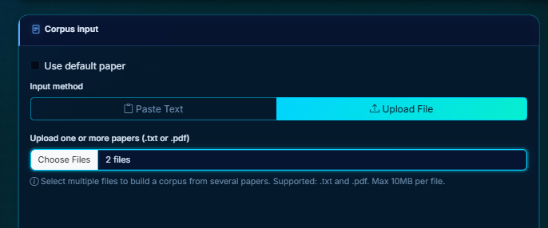

**Option C — Use the default paper**

Turn on the **Use default paper** toggle. The run uses the built-in BrainIT paper, and any text or files you have added are ignored.

---

### 2.2 Configuring the run

> Click **"What do these options do?"** at the top of the right panel to expand a short glossary. Each option also has a **ⓘ** tooltip on hover.

**Prompting method**

This controls how the LLM is guided during extraction:

| Strategy | What it does |
|----------|-------------|
| **Zero-Shot** | No examples — the LLM works purely from the text. This is the baseline. |
| **One-Shot** | One retrieved example is included per chunk to give the LLM a format to follow. A separate hierarchy step runs when the text contains obvious hierarchy cues. |
| **Few-Shot** | Three dedicated extraction phases, each with its own examples. Phase 1 extracts concepts broadly, Phase 2 picks up relations (and any concepts Phase 1 missed), and Phase 3 extracts hierarchy edges — but only when the text contains cues like "such as", "is a", or "type of". Instructions actively discourage the LLM from copying the example content. |

**Pipeline mode**

Each mode adds a layer on top of the previous one:

| Mode | What it adds |
|------|-------------|
| **1 · Strict** | Raw extraction with no vocabulary guardrails, no gold filtering, no NER. Evidence is the only quality gate. Restricted to Zero-Shot prompting only. |
| **2 · Guided** | Everything in Mode 1, plus vocabulary guardrails, gold-vocabulary evaluation filtering, medical NER anchoring, and candidate term suggestions. |
| **3 · Schema-Completed** | Everything in Mode 2, plus schema-guided completion (fills in gold-schema items supported by corpus evidence) and rule-based reasoning to tidy the hierarchy. |

**LLM provider**

Pick which model does the extraction:

| Provider | Model |
|----------|-------|
| **OpenAI** | GPT-4o-mini (default) |
| **OpenAI** | GPT-4o |
| **Anthropic** | Claude Haiku 4.5 |
| **Google** | Gemini 2.5 Flash |
| **Groq** | Llama 3.1 8B (free) |
| **Hugging Face** | Mistral 7B (free) |
| **DeepSeek** | deepseek-chat |

**Evaluation settings**

The **Gold-vocabulary-only** option filters the generated ontology down to the gold vocabulary before computing precision and recall. It is an evaluation control — it does not change what gets extracted, and the full unfiltered output is always saved alongside.

**Advanced / Experimental**

Expand this section to change the reasoning LLM — the model used for schema-guided completion. Choose between **OpenAI GPT-4o-mini** (default) and **DeepSeek Reasoner R1** (stronger reasoning, slower).

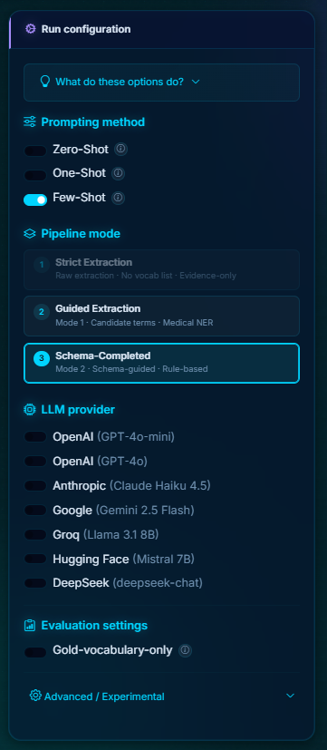

---

### 2.3 Starting the run

Click **Run experiment** at the bottom of the left panel. The app takes you to the progress page.

---

## 3. Controlled experiment page

This page gives full granular control over every pipeline stage. Instead of the three predefined pipeline modes, you get **18 individual pipeline toggles** grouped into three sections:

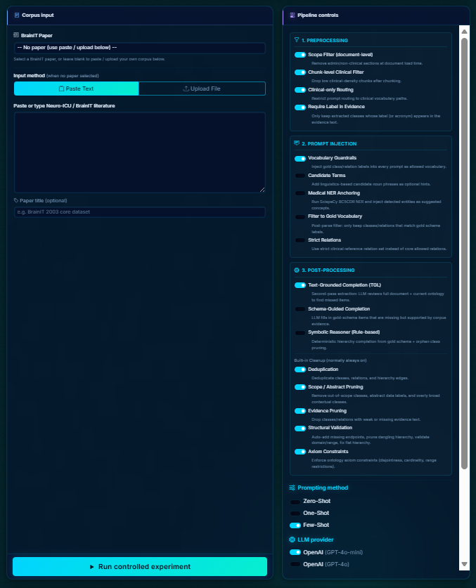

### 3.1 Input

At the top of the left panel, a **BrainIT Paper** dropdown lets you select any of the 11 built-in BrainIT papers directly. Select a paper and its full text is loaded automatically — no pasting or uploading needed. You can also leave the dropdown blank and paste or upload your own corpus below it.

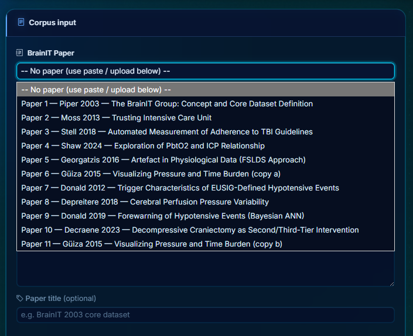

### 3.2 Pipeline controls

The right panel exposes every pipeline feature as an independent on/off switch:

**1. Preprocessing (5 toggles)**

| Toggle | What it does |
|--------|-------------|
| **Scope Filter** | Remove admin/non-clinical sections at document load time. |
| **Chunk-level Clinical Filter** | Drop low clinical-density chunks after chunking. |
| **Embedding Scope Fallback** | Use sentence-transformer embeddings to classify borderline chunks when keyword scores are ambiguous. |
| **Clinical-only Routing** | Restrict prompt routing to clinical vocabulary paths. |
| **Require Label in Evidence** | Only keep extracted classes whose label appears in the evidence text. |

**2. Prompt Injection (5 toggles)**

| Toggle | What it does |
|--------|-------------|
| **Vocabulary Guardrails** | Inject gold class/relation labels into every prompt as allowed vocabulary. |
| **Candidate Terms** | Add linguistics-based candidate noun phrases as optional hints. |
| **Medical NER Anchoring** | Run ScispaCy BC5CDR NER and inject detected entities as suggested concepts. |
| **Filter to Gold Vocabulary** | Post-parse filter: only keep classes/relations matching gold schema labels. |
| **Strict Relations** | Use strict clinical reference relation set instead of core allowed relations. |

**3. Post-Processing (8 toggles)**

| Toggle | What it does |
|--------|-------------|
| **Text-Grounded Completion** | Second-pass extraction: LLM reviews full document + current ontology to find missed items. |
| **Schema-Guided Completion** | LLM fills in gold-schema items that are missing but supported by corpus evidence. |
| **Symbolic Reasoner** | Deterministic hierarchy completion from gold schema + orphan class pruning. |
| **Deduplication** | Deduplicate classes, relations, and hierarchy edges. |
| **Scope / Abstract Pruning** | Remove out-of-scope classes, abstract data labels, and overly broad contextual classes. |
| **Evidence Pruning** | Drop classes/relations with weak or missing evidence text. |
| **Structural Validation** | Auto-add missing endpoints, prune dangling hierarchy, validate domain/range. |
| **Axiom Constraints** | Enforce ontology axiom constraints (disjointness, cardinality, range restrictions). |

Below the toggles are the same **Prompting method**, **LLM provider**, **Evaluation**, and **Advanced** sections as the home page.

This page is designed for ablation studies — toggle individual features on/off to measure their contribution.

---

## 4. Progress page

This page updates in real time while the pipeline runs.

| Element | What it shows |
|---------|--------------|
| **Run ID** | A unique identifier for this run (`YYYYMMDD-HHMMSS-<hash>`). |
| **Status badge** | Running / Completed / Failed / Cancelled. |
| **Progress bar** | How far through the chunks the pipeline is. |
| **Progress message** | The current step, e.g. "Processing chunk 3 of 12". |
| **Live knowledge graph** | A growing visual network of the classes and relations extracted so far. |
| **Triple stream** | The latest Subject, Predicate, Object extractions shown as pills. |

Click **Cancel** to stop early — a confirmation dialog appears, and if you confirm, the run stops and its files are deleted.

When the run finishes, the page automatically redirects to the Results page.

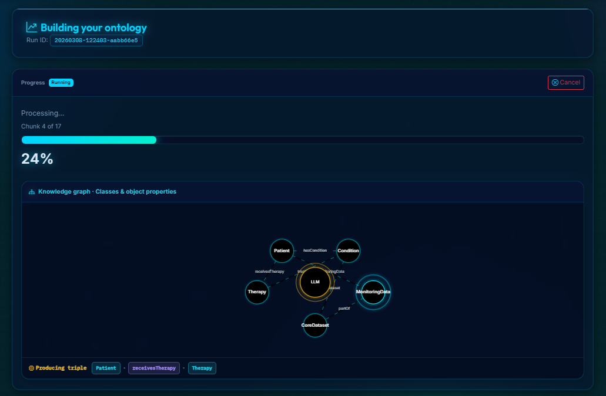

---

## 5. Results page

### 5.1 Evaluation metrics

The left card shows the full evaluation metrics:

| Metric group | What is included |
|---|---|
| **Class** | Coverage, precision, recall, hallucinations, schema violations, omissions. |
| **Structural** | Hierarchy edges, hierarchy coverage, relation domain/range rate. |
| **Relations** | Precision, recall, counts, and a per-relation breakdown. |
| **Clinical-only** | The same class metrics but limited to clinical vocabulary. |

Below the metrics is a **per-stage ablation table** showing how the ontology changed at each pipeline stage:

```
Stage              Classes  Rels  Hier  Coverage  Precision  Recall
──────────────────────────────────────────────────────────────────
Extraction              35     8    28    48.61%    100.00%  48.61%
+ Schema-Guided         59    22    59    79.17%    100.00%  79.17%
+ Cleanup               57    19    19    79.17%    100.00%  79.17%
+ Rule-based            57    19    41    79.17%    100.00%  79.17%
```

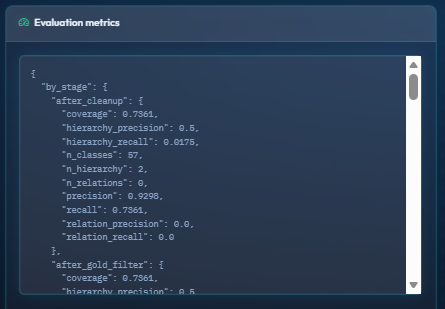

---

### 5.2 Knowledge artifacts

The right card lists everything the run produced. Click any link to view or download.

| Artifact | File | What it contains |
|----------|------|-----------------|
| **Ontology** | `ontology.json` | The full generated ontology — classes, relations, and hierarchy with evidence. |
| **Restricted ontology** | `ontology_restricted.json` | A copy filtered to the gold vocabulary, used for evaluation. Only produced when Gold-vocab is on. |
| **Summary** | `summary.txt` | A human-readable report covering metadata, input papers, metrics, the ablation table, and full listings. |
| **Metrics** | `metrics.json` | All metrics in structured form, including per-stage and per-relation breakdowns. |
| **Improvement counts** | `improvement_counts.json` | How many classes, relations, and hierarchy edges were added or removed at each stage. |
| **SGC diagnostic** | `sgc_diagnostic.json` | Counts from the schema-guided completion step — raw response size, items parsed, items kept. |
| **Prompts** | `prompt_chunk_NNNN.txt` | The exact prompt sent to the LLM for each chunk and phase. |
| **Metadata** | `metadata.json` | Run configuration, input file names, environment info, and code version. |

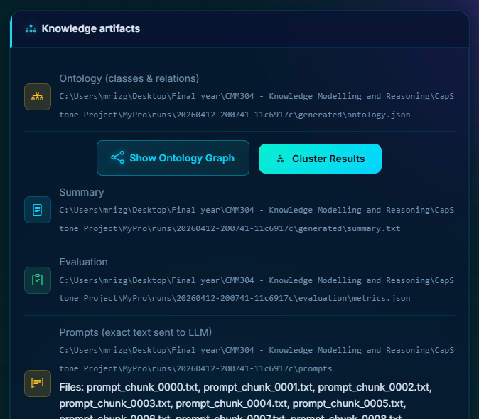

---

### 5.3 Ontology graph

If an ontology was produced, a **Show Ontology Graph** button appears near the artifacts.

1. Click **Show Ontology Graph**.
2. A full-screen interactive graph opens, powered by Cytoscape.js.

| Feature | How it works |
|---------|-------------|
| **Colour-coded nodes** | Classes are coloured by type: teal = core, amber = governance, purple = provenance, grey = inferred. |
| **Edge types** | Solid cyan edges show hierarchy (subClassOf); dashed orange edges show relations (domain to range). |
| **Click a node** | Highlights the node and its neighbours. A panel on the right shows its label, definition, parents, children, related relations, and evidence. |
| **Layout switcher** | Switch between Force (physics), Tree (hierarchical), Circle, and Grid layouts. |
| **Export** | Click **PNG** in the toolbar to save the current graph view as an image. |
| **Stats bar** | Shows the total class, relation, and hierarchy edge counts at the bottom. |

3. Click **Close** or press **Escape** to go back to the results page.

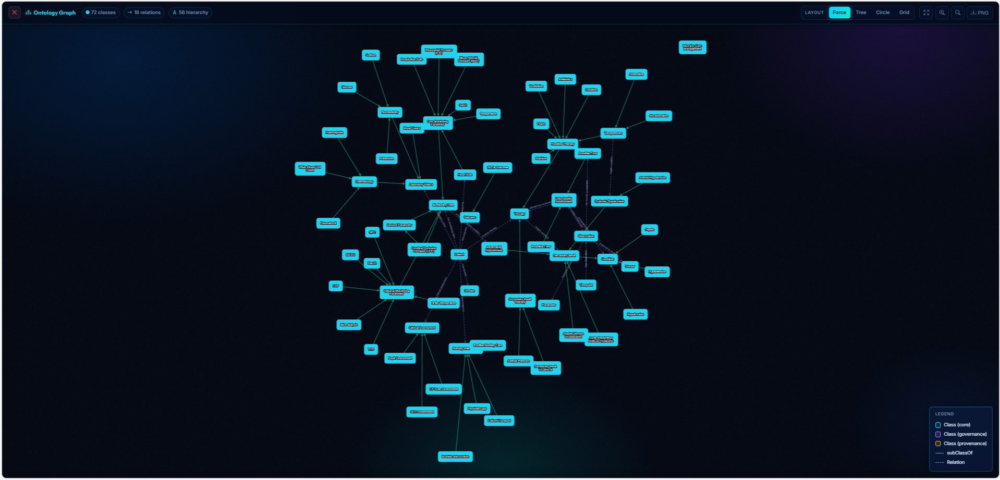

---

## 6. Running a batch comparison

Click **Run comparison** in the navigation bar. This page has the same corpus input on the left, and a configuration panel on the right, but instead of running immediately you build a list of configurations to run one after another.

The comparison page also includes a **BrainIT Paper** dropdown, so each run in the batch can target a different paper, or all runs can share the same corpus.

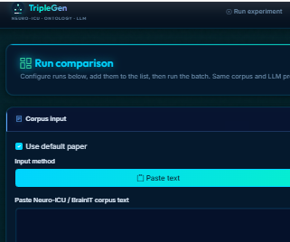

---

### 6.1 Adding runs to the batch

1. Set up a configuration using the right panel — same options as a single run.
2. Click **Add run**. It appears as a new row in the table below.
3. Change any options and click **Add run** again to add another configuration.
4. Use **Reset** at any point to clear all fields back to defaults.

---

### 6.2 The runs table

Each row in the table represents one configuration:

| Column | What it shows |
|--------|--------------|
| **Checkbox** | Select this row for running or analysis. |
| **#** | Row number. |
| **Run name** | An auto-generated label, e.g. `Few-Shot - Schema-Completed - GPT-4o-mini - Gold-vocab - None`. |
| **Strategy** | Zero-Shot / One-Shot / Few-Shot. |
| **Pipeline mode** | Strict / Guided / Schema-Completed / Controlled. |
| **LLM** | Provider and model. |
| **Eval settings** | Gold-vocab or None. |
| **Advanced** | DSR (DeepSeek Reasoner) or None. |
| **Actions** | View the last result, view the full analysis history, or remove the row. |

The **Select all** checkbox selects or deselects everything at once.

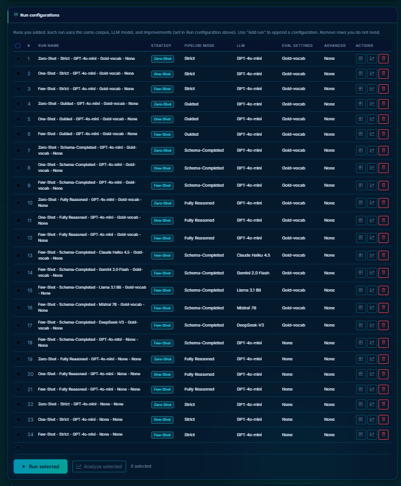

---

### 6.3 Running the batch

1. Tick the rows you want to run (or use **Select all**).
2. Click **Run selected**. The app takes you to the batch progress page.

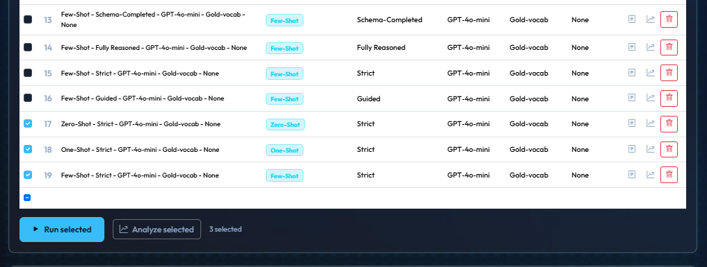

---

## 7. Batch progress page

Each configuration gets its own status row:

| Element | What it shows |
|---------|--------------|
| **Run label** | The configuration name. |
| **Run ID** | Assigned when the run starts. |
| **Status badge** | Pending / Running / Paused / Completed / Failed / Skipped / Cancelled. |

Runs execute one at a time in sequence. For each running run you can **Pause**, **Resume**, or **Skip** it. **Cancel** stops everything that has not finished yet; already-completed runs are kept.

When everything is done, an **Analyze** button appears to open the batch analysis.

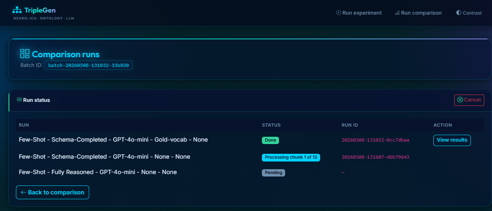

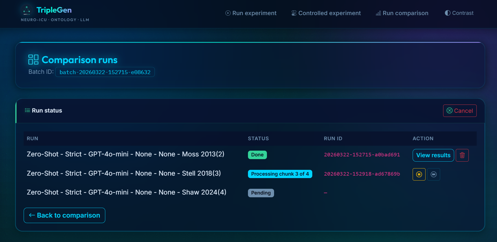

---

## 8. Comparing and analysing results

### 8.1 Analyze selected

From the **Run comparison** page (no need to re-run anything), tick the configurations you want to compare and click **Analyze selected**. A modal shows the last completed run for each configuration.

| Column | What it shows |
|--------|--------------|
| **Run** | Row label. |
| **Overall F1** | Mean of Class, Hierarchy, and Relation F1. |
| **Class F1** | F1 for class extraction (harmonic mean of precision and recall). |
| **Hier F1** | F1 for hierarchy edge extraction. |
| **Rel F1** | F1 for relation extraction. |
| **View** | Opens the full Results page for that run in a new tab. |

The best-performing run (by Overall F1) gets a "best" badge. A grouped bar chart shows all four F1 dimensions per run (Overall in green, Class in cyan, Hierarchy in orange, Relation in purple), and a Class F1 vs Hierarchy F1 scatter plot is shown alongside the table. You can search by run name and switch between Top 10, Top 20, or All views.

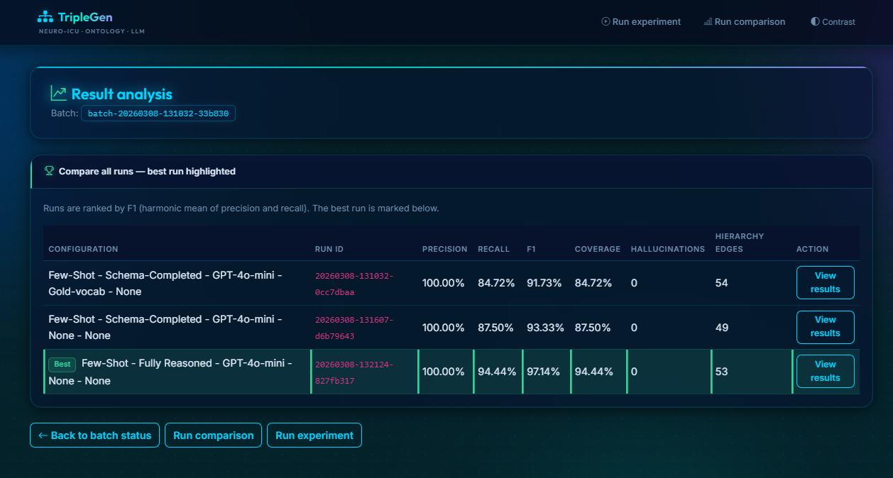

---

### 8.2 Per-run actions

In the runs table, each row has two action buttons:

| Button | What it does |
|--------|-------------|
| **Last result** (clipboard icon) | Shows a summary of the most recent completed run for this configuration. |
| **Analysis** (chart icon) | Shows Overall F1, Class F1, Hier F1, and Rel F1 for every past run with this exact configuration — useful for seeing consistency across repeated runs. |

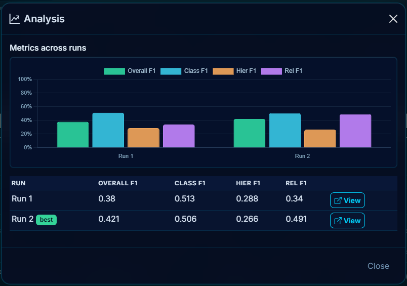

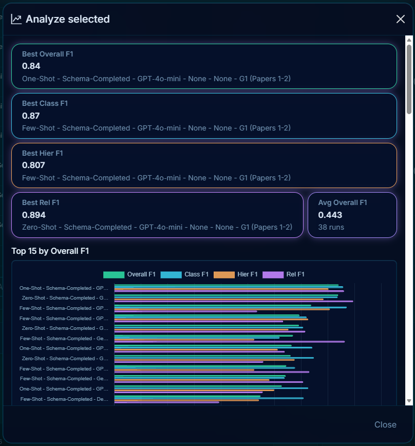

---

### 8.3 Batch analysis

After a batch finishes from the Batch progress page, click **Analyze** to see a full comparison table showing Overall F1, Class F1, Hier F1, and Rel F1 for every run. The best run (by Overall F1) is highlighted, and each row has a **View** link to open its Results page.

---

## 9. The summary file

Every run saves a `summary.txt` that you can open from the Results page. It is the easiest way to read everything in one place.

| Section | What it covers |
|---------|---------------|
| **Metadata** | Run ID, timestamp, prompting method, pipeline mode, LLM, evaluation settings. |
| **Input papers** | The filenames you provided. Pasted text shows your chosen title, or `corpus.txt` if you did not enter one. |
| **Improvement counts** | How many classes, relations, and hierarchy edges were added, removed, or inferred at each stage. |
| **Final metrics** | Coverage, precision, recall, errors, structural metrics, clinical-only metrics, relation precision/recall. |
| **Extraction-only metrics** | The same metrics before any improvement step — your raw LLM baseline. |
| **Per-stage ablation table** | A compact table showing how the ontology changed at every stage. |
| **Concept counts** | Total classes, relations, and hierarchy edges in the final ontology. |
| **Full listings** | Every class, relation, and hierarchy edge with labels and evidence. |

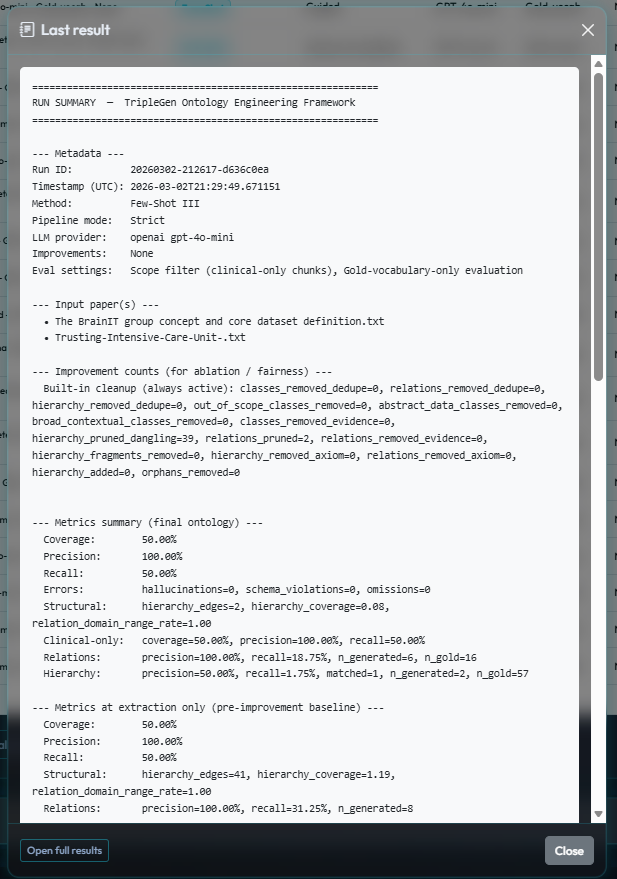

---

## 10. Run labels explained

Every run gets a label that describes its exact configuration:

```
Strategy - PipelineMode - LLM - EvalSettings - Advanced
```

**Examples:**

| Label | What it means |
|-------|--------------|
| `Few-Shot - Schema-Completed - GPT-4o-mini - Gold-vocab - None` | 3-phase Few-Shot extraction, Schema-Completed mode, OpenAI GPT-4o-mini, gold-vocab evaluation, no advanced options. |
| `Zero-Shot - Strict - Anthropic - None - None` | Zero-Shot baseline, strict mode, using Anthropic Claude Haiku 4.5. |
| `Few-Shot - Schema-Completed - GPT-4o-mini - Gold-vocab - DSR` | Few-Shot with DeepSeek Reasoner handling schema-guided completion. |
| `Few-Shot - Controlled - GPT-4o-mini - Gold-vocab - None` | Few-Shot with custom pipeline toggle overrides from the Controlled Experiment page. |

This label appears everywhere — the comparison table, run list, batch progress, summary file, and metadata.

---

## 11. Ontology engineering page

Click **Ontology engineering** in the navigation bar. This page is different from every other page in the app — instead of running an extraction over a corpus, it reconstructs a single, richer ontology by combining the output of *multiple prior runs* and asking the LLM to enrich each semantic cluster of classes.

The page uses a **three-stage workflow**: Load → Cluster → Reconstruct. Each stage unlocks the next when it finishes.

The key design properties:

- **No new classes** — the LLM is constrained to rearrange and enrich the merged source. Any class it tries to invent is dropped post-parse.
- **Closed relation vocabulary** — the allowed relation labels are self-seeded from the merged source's existing relations. The LLM never sees the gold standard, and any out-of-vocabulary relation it produces is dropped.
- **Hierarchy passthrough** — the LLM is told not to emit hierarchy. All hierarchy in the final ontology comes from the source seed.
- **Source-seeded merge** — the merged source ontology is prepended to the cluster fragments, so anything the LLM forgets to re-emit is rescued from the source.

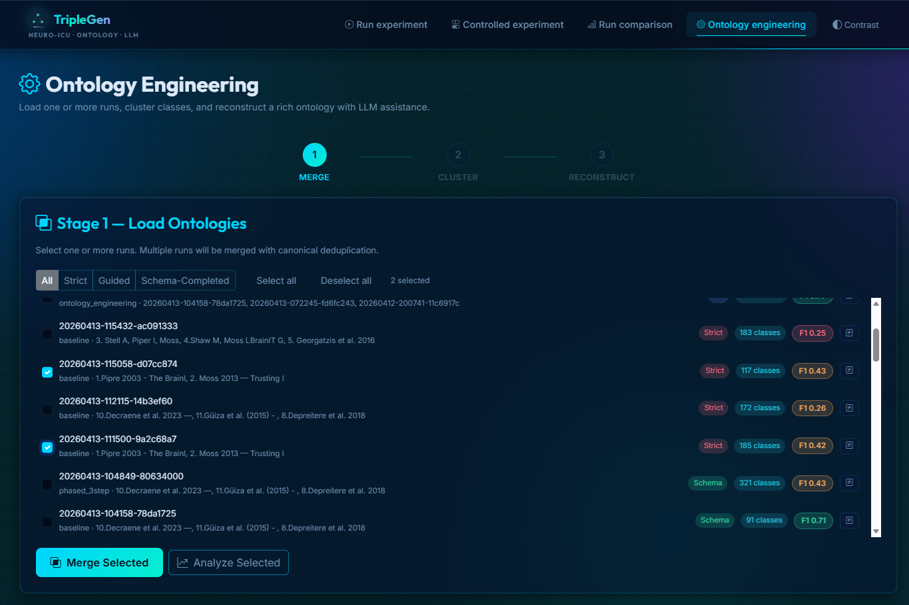

---

### 11.1 Stage 1 — Picking and loading source runs

The top card lists all prior runs whose `ontology.json` is on disk. Each run shows its strategy, pipeline mode (as a colour-coded badge), LLM provider, paper name, and class count.

**Filtering and selection:**

| Control | What it does |
|---------|-------------|
| **Pipeline mode filter** (All / Strict / Guided / Schema-Completed) | Narrows the run list by mode. |
| **Select all / Deselect all** | Bulk toggle all visible runs. |
| **Individual checkboxes** | Pick specific runs to combine. |

Tick the runs you want to merge and click **Load Selected**. The app loads each run's `ontology.json`, merges them by canonical key into one source ontology, and displays merge statistics (total classes, relations, hierarchy edges).

**Analyze button:** Before merging, you can click **Analyze** to compare evaluation metrics (Overall F1, Class F1, Hier F1, Rel F1) across the selected source runs — the same 4-bar chart format used on the comparison dashboard.

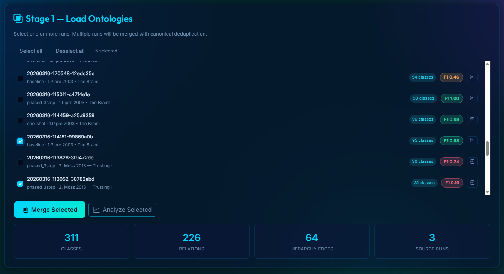

---

### 11.2 Stage 2 — Clustering

Once sources are loaded, the clustering stage unlocks. Click **Run Clustering** to semantically cluster the merged classes using `all-MiniLM-L6-v2` sentence embeddings and Ward's hierarchical clustering.

The clustering results include:

| Element | What it shows |
|---------|--------------|
| **Merge statistics** | Total merged classes, relations, hierarchy edges. |
| **Cluster scatter plot** | 2D t-SNE projection of class embeddings, coloured by cluster. |
| **Silhouette chart** | Per-cluster silhouette scores showing cluster cohesion. |
| **Cluster cards** | Each cluster listed with its member classes. |

**Load Previous Cluster:** A dropdown above Stage 2 lets you reload clustering results from a previous session — skipping Stage 1 entirely.

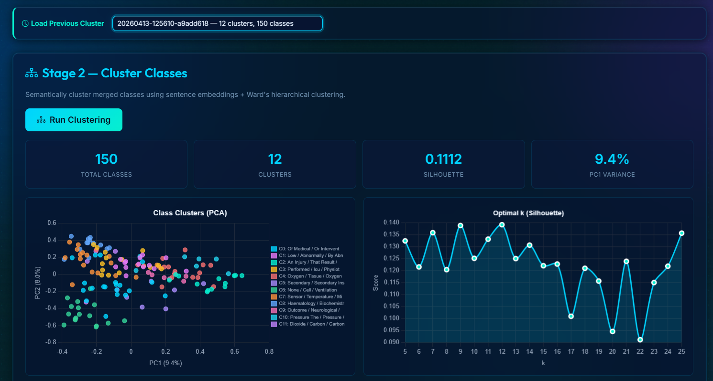

---

### 11.3 Stage 3 — LLM Reconstruction

Once clustering is complete, the reconstruction stage unlocks.

**LLM provider selector:** Choose which model performs the per-cluster enrichment — the same provider list as the rest of the app (GPT-4o-mini, GPT-4o, Claude Haiku 4.5, Gemini 2.5 Flash, DeepSeek).

Click **Reconstruct Ontology**. The app:

1. For each cluster, calls the LLM with the closed relation vocabulary inline in the prompt and asks it to enrich the cluster.
2. Filters the LLM output (drops new classes, drops out-of-vocab relations, drops any hierarchy edges).
3. Merges all cluster fragments back together with the source seed.
4. Runs the result through the standard evaluator.

A progress bar and per-cluster status messages update in real time.

**Load Previous OE Run:** A dropdown above Stage 3 lets you reload a previous reconstruction — skipping Stages 1 and 2.

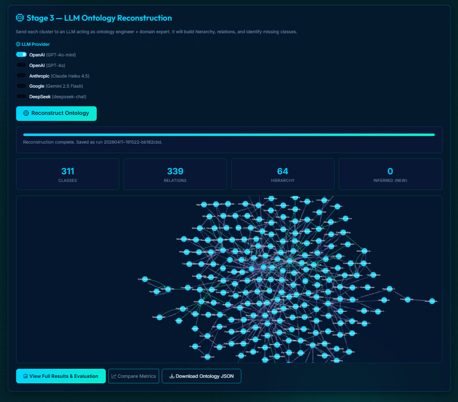

---

### 11.4 Reconstruction results

When the reconstruction finishes, the page shows:

| Element | What it does |
|---------|-------------|
| **Reconstruction statistics** | Total classes, relations, hierarchy edges in the final ontology. |
| **Per-cluster cards** | Each cluster with its member classes, added relations, dropped out-of-vocab relations, and dropped inferred classes. |
| **View Full Results & Evaluation** | Opens the full Results page (metrics, artifacts, ontology graph) in an embedded modal or new tab. |
| **Compare Metrics** | Opens the compare metrics modal (see Section 11.5). |
| **Download Ontology JSON** | Download the reconstructed ontology as JSON. |
| **Download Ontology TTL** | Download the reconstructed ontology in OWL/RDF Turtle format. |

The per-cluster view is the cleanest way to *see* what the LLM did per cluster — and to confirm that no new classes leaked through.

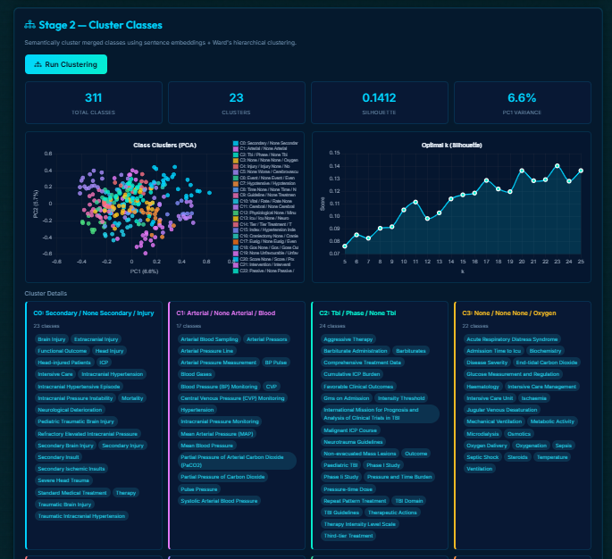

---

### 11.5 Compare metrics modal

The **Compare Metrics** button opens a modal showing every reconstruction run side by side, ranked by **Overall F1** (the mean of class F1, hierarchy F1, and relation F1). Each row also shows the individual class / hierarchy / relation F1, the source run IDs, and a link to open the reconstructed ontology's full Results page.

A grouped bar chart plots the four F1 values per run (Overall in green, Class in cyan, Hierarchy in orange, Relation in purple) so you can spot trade-offs at a glance — for example, a reconstruction that gains hierarchy F1 at the cost of a small drop in relation F1.

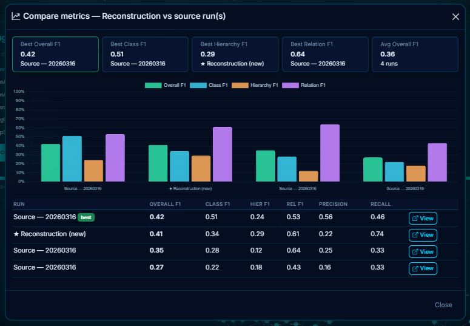

---

### 11.6 Reconstruction artifacts

A reconstruction run produces the same artifact set as a normal run (`ontology.json`, `metrics.json`, `summary.txt`, etc.) plus an extra `cluster_completion_log.json` recording:

- the number of clusters
- the prompt and response length per cluster
- how many "inferred" classes were dropped
- how many relations were dropped by the closed-vocabulary filter
- how many hierarchy edges were dropped

The run's `metadata.json` is also tagged with `closed_relation_vocab: true`, `n_allowed_relations: <count>`, `hierarchy_from_source_only: true`, and `source_seeded: true` so reconstruction runs are clearly distinguishable from normal extraction runs.

---

## Where are my run files?

All outputs are saved under `runs/<run_id>/`:

```
runs/<run_id>/
├── metadata.json                  # Config, input papers, environment
├── generated/
│   ├── ontology.json              # Full generated ontology
│   ├── ontology_restricted.json   # Gold-filtered copy (when Gold-vocab is on)
│   └── summary.txt                # Human-readable report
├── evaluation/
│   ├── metrics.json               # All metrics (by_stage, relations, etc.)
│   ├── improvement_counts.json
│   ├── axiom_violations.json
│   └── hallucinated_classes.json
└── prompts/
    ├── prompt_chunk_0000_phase1.txt
    ├── prompt_chunk_0000_phase2.txt
    ├── sgc_prompt.txt             # Schema-guided completion prompt
    ├── sgc_response.txt           # SGC raw LLM response
    ├── sgc_diagnostic.json        # SGC parsing counts
    └── ...
```
