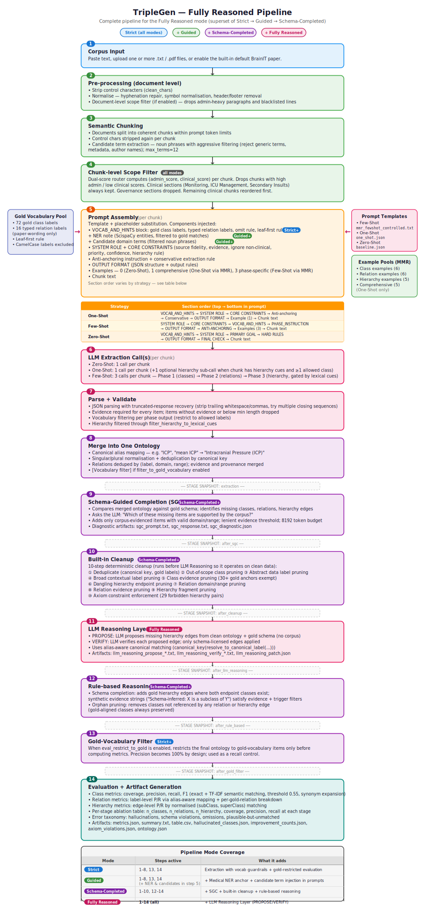

# TripleGen Pipeline

This document is the written companion to the pipeline diagram below. The diagram shows the **Fully Reasoned mode** (M4), which is the full superset — every other mode is a subset of it. Read the diagram step by step for the visual flow, and this document for additional context on each zone.

---

## Pipeline Diagram

*Full pipeline covering all four progressive modes: Strict · Guided · Schema-Completed · Fully Reasoned.*

---

## Pipeline Summary

The pipeline is organised into four functional zones across 14 numbered steps.

---

### Zone 1 — Input and Preprocessing (Steps 1–4)

| Step | Name | What it does | Mode |
|------|------|-------------|------|
| 1 | **Corpus Input** | Paste text, upload `.txt`/`.pdf` files, or use the built-in default BrainIT paper | All |
| 2 | **Pre-processing (document level)** | Strip control characters (`clean_chars`); normalise — hyphenation repair, symbol normalisation, header/footer removal; document-level scope filter drops admin-heavy paragraphs and blacklisted lines | All |
| 3 | **Semantic Chunking** | Split documents into coherent chunks within prompt token limits; control chars stripped again per chunk; candidate term extraction — noun phrases with aggressive filtering (reject generic terms, metadata, author names); `max_terms=12` | All |
| 4 | **Chunk-level Scope Filter** | Dual-score router computes (`admin_score`, `clinical_score`) per chunk. Drops chunks with high admin / low clinical scores. Clinical sections (Monitoring, ICU Management, Secondary Insults) always kept. Governance sections dropped. Remaining clinical chunks reordered first. | All |

---

### Zone 2 — Per-Chunk Extraction Loop (Steps 5–8)

Repeated for every chunk that passes the scope filter. Each iteration assembles a prompt, calls the extraction LLM, parses the output, and merges results.

#### Step 5 — Prompt Assembly (per chunk)

Template + placeholder substitution. The following components are injected:

- **VOCAB_AND_HINTS block** — gold class labels, typed relation labels, omit rule, leaf-first rule *(Strict+)*
  - \+ NER note (ScispaCy entities, filtered to gold matches) *(Guided+)*
  - \+ Candidate domain terms (filtered noun phrases) *(Guided+)*
- **SYSTEM ROLE + CORE CONSTRAINTS** — source fidelity, evidence, ignore non-clinical, priority, confidence, hierarchy rule
- **Anti-anchoring instruction** + conservative extraction rule
- **OUTPUT FORMAT** — JSON structure + output rules
- **Examples** — 0 (Zero-Shot), 1 comprehensive (One-Shot via MMR), 3 phase-specific (Few-Shot via MMR)
- **Chunk text**

The section order within the prompt varies by strategy:

| Strategy | Section order (top → bottom in prompt) |
|----------|----------------------------------------|
| **One-Shot** | `VOCAB_AND_HINTS` → `SYSTEM ROLE` → `CORE CONSTRAINTS` → `Anti-anchoring` → `Conservative` → `OUTPUT FORMAT` → `Example (1)` → Chunk text |
| **Few-Shot** | `SYSTEM ROLE` → `CORE CONSTRAINTS` → `VOCAB_AND_HINTS` → `PHASE_INSTRUCTION` → `OUTPUT FORMAT` → `ANTI-ANCHORING` → `Examples (3)` → Chunk text |
| **Zero-Shot** | `VOCAB_AND_HINTS` → `SYSTEM ROLE` → `PRIMARY GOAL` → `HARD RULES` → `OUTPUT FORMAT` → `FINAL CHECK` → Chunk text |

Examples are retrieved using **MMR (λ=0.7)** with TF-IDF cosine similarity. Few-Shot uses three separate pools (class ×6, relation ×6, hierarchy ×5), one per phase. One-Shot uses a single comprehensive pool (×5).

#### Step 6 — LLM Extraction Call(s) (per chunk)

| Strategy | Calls per chunk |
|----------|----------------|
| **Zero-Shot** | 1 call |
| **One-Shot** | 1 call (+1 optional hierarchy sub-call when the chunk has hierarchy cues and ≥1 allowed class) |
| **Few-Shot** | 3 calls — Phase 1 (classes) → Phase 2 (relations) → Phase 3 (hierarchy, gated by lexical cues) |

#### Step 7 — Parse + Validate

- JSON parsing with truncated-response recovery (strip trailing whitespace/commas, try multiple closing sequences)
- Evidence required for every item; items without evidence or below min length dropped
- Vocabulary filtering per phase output (restrict to allowed labels)
- Hierarchy filtered through `filter_hierarchy_to_lexical_cues`

#### Step 8 — Merge into One Ontology

- Canonical alias mapping — e.g. "ICP", "mean ICP" → "Intracranial Pressure (ICP)"
- Singular/plural normalisation + deduplication by canonical key
- Relations deduped by (label, domain, range); evidence and provenance merged
- [Vocabulary filter] if `filter_to_gold_vocabulary` enabled

**Stage snapshot saved:** `extraction`

---

### Zone 3 — Post-Processing (Steps 9–13)

Fixed order: **SGC → Built-in Cleanup → LLM Reasoning → Rule-based Reasoning → Gold-Vocabulary Filter**

| Step | Name | What it does | Mode |
|------|------|-------------|------|
| 9 | **Schema-Guided Completion (SGC)** | Compares merged ontology against gold schema; identifies missing classes, relations, hierarchy edges. Asks the LLM: *"Which of these missing items are supported by the corpus?"* Adds only corpus-evidenced items with valid domain/range; lenient evidence threshold; 8192 token budget. Diagnostic artifacts: `sgc_prompt.txt`, `sgc_response.txt`, `sgc_diagnostic.json` | Schema-Completed+ |
| 10 | **Built-in Cleanup** | 10-step deterministic cleanup (runs before LLM Reasoning so it operates on clean data): ① Deduplicate ② Out-of-scope class pruning ③ Abstract data label pruning ④ Broad contextual label pruning ⑤ Class evidence pruning (30+ gold anchors exempt) ⑥ Dangling hierarchy endpoint pruning ⑦ Relation domain/range pruning ⑧ Relation evidence pruning ⑨ Hierarchy fragment pruning ⑩ Axiom constraint enforcement (29 forbidden hierarchy pairs) | Schema-Completed+ |
| 11 | **LLM Reasoning Layer** | PROPOSE — LLM proposes missing hierarchy edges from clean ontology + gold schema (no corpus). VERIFY — LLM verifies each proposed edge; only schema-licensed edges applied. Uses alias-aware canonical matching (`canonical_key(resolve_to_canonical_label(...))`). Artifacts: `llm_reasoning_propose_*.txt`, `llm_reasoning_verify_*.txt`, `llm_reasoning_patch.json` | Fully Reasoned |
| 12 | **Rule-based Reasoning** | Schema completion — adds gold hierarchy edges where both endpoint classes exist; synthetic evidence strings ("Schema-inferred: X is a subclass of Y") satisfy evidence + trigger filters. Orphan pruning — removes classes not referenced by any relation or hierarchy edge (gold-aligned classes always preserved) | Schema-Completed+ |
| 13 | **Gold-Vocabulary Filter** | When `eval_restrict_to_gold` is enabled, restricts the final ontology to gold-vocabulary items only before computing metrics. Precision becomes 100% by design; used as a recall control. | Strict+ |

**Stage snapshots saved (in order):** `after_sgc` → `after_cleanup` → `after_llm_reasoning` → `after_rule_based` → `after_gold_filter`

---

### Zone 4 — Evaluation and Artifact Generation (Step 14)

Metrics are computed across all stage snapshots for per-stage ablation analysis.

**Metrics computed:**

- **Class metrics** — coverage, precision, recall, F1 (exact + TF-IDF semantic matching, threshold 0.55, synonym expansion)
- **Relation metrics** — label-level P/R via alias-aware mapping + per-gold-relation breakdown
- **Hierarchy metrics** — edge-level P/R by normalised (subClass, superClass) matching
- **Per-stage ablation table** — n_classes, n_relations, n_hierarchy, coverage, precision, recall at each stage
- **Error taxonomy** — hallucinations, schema violations, omissions, plausible-but-unmatched

**Artifacts written to `runs/<run_id>/`:**

| File | Contents |
|------|----------|
| `ontology.json` | Final generated ontology |
| `ontology_restricted.json` | Gold-vocab-restricted variant (when Gold-vocab is on) |
| `metrics.json` | Full metrics including per-stage ablation |
| `table.csv` | Metrics table |
| `summary.txt` | Human-readable run summary |
| `hallucinated_classes.json` | Error taxonomy output |
| `improvement_counts.json` | Per-feature counts of items added/removed at each stage |
| `axiom_violations.json` | Constraint violation log |
| `sgc_diagnostic.json` | SGC filter stage counts |
| `prompt_chunk_NNN.txt` | Per-chunk saved prompts |
| `llm_reasoning_patch.json` | LLM Reasoning Layer output |
| `metadata.json` | Run configuration and code version |

---

## Pipeline Mode Coverage

| Mode | Steps active | What it adds |
|------|-------------|-------------|
| **Strict** | 1–8, 13, 14 | Extraction with vocab guardrails + gold-restricted evaluation |
| **Guided** | 1–8, 13, 14 *(+ NER & candidates in step 5)* | + Medical NER anchor + candidate term injection in prompts |
| **Schema-Completed** | 1–10, 12–14 | + SGC + built-in cleanup + rule-based reasoning |
| **Fully Reasoned** | **1–14 (all)** | + LLM Reasoning Layer (PROPOSE/VERIFY) |

---

## Technology Stack

| Component | Technology |
|-----------|------------|
| Language | Python 3.10+ |
| Extraction LLMs | OpenAI GPT-4o-mini, Anthropic Claude Haiku 4.5, Google Gemini 2.5 Flash, Groq Llama 3.1 8B, Hugging Face Mistral 7B, DeepSeek |
| Reasoning LLMs | OpenAI GPT-4o-mini, DeepSeek Reasoner R1 |
| Retrieval | TF-IDF + cosine similarity + MMR (λ=0.7) |
| Medical NER | ScispaCy `en_ner_bc5cdr_md` |
| Ontology serialisation | JSON (internal), OWL/RDF Turtle (gold standard), rdflib |
| Web UI | Flask + Cytoscape.js |
| Evaluation | Custom alignment, TF-IDF semantic matching (threshold 0.55), per-stage ablation |

---

## Related Documents

- [README.md](README.md) — full methodology, research context, and feature overview
- [TripleGen_WepApp.md](TripleGen_WepApp.md) — web interface walkthrough with screenshots
