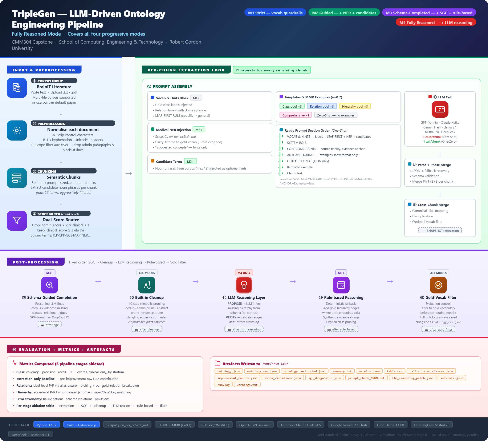

# TripleGen Pipeline

This document provides a visual overview of the TripleGen pipeline in **Fully Reasoned mode** (M4), which covers all four progressive modes. For a detailed narrative walkthrough of each step, see the implementation summary.

---

## Pipeline Poster

*Full pipeline covering all four progressive modes: M1 Strict, M2 Guided, M3 Schema-Completed, M4 Fully Reasoned.*

---

## Pipeline Summary

The TripleGen pipeline is divided into four functional zones:

### Zone 1 — Input and Preprocessing

| Step | Description | Mode |
|------|-------------|------|
| Corpus Input | BrainIT literature supplied as pasted text, uploaded `.txt`/`.pdf`, or built-in default corpus | All |
| Preprocessing | Strip control characters, fix hyphenation, normalise Unicode, remove repeated headers/footers | All |
| Chunking | Split into prompt-sized semantic chunks; extract candidate noun phrases (max 12 per chunk) | All |
| Scope Filter (chunk-level) | Dual-score router: drop chunks where `admin_score ≥ 2` and `clinical_score ≤ 1`; always keep chunks with strong clinical terms (ICP, CPP, GCS, MAP, …) | All |

The scope filter also operates at **document level** before chunking, dropping administrative paragraphs and blacklisted lines.

### Zone 2 — Per-Chunk Extraction Loop

Repeated for every chunk that survives the scope filter. Each iteration assembles a prompt and calls the extraction LLM.

**Prompt assembly** varies by strategy:

| Strategy | Calls per Chunk | Prompt Section Order |
|----------|----------------|---------------------|
| One-Shot | 1 | VOCAB & HINTS → Medical NER → Candidates → CORE CONSTRAINTS → ANTI-ANCHORING → OUTPUT FORMAT → Retrieved example → Chunk text |
| Few-Shot | 3 (Phase 1: classes, Phase 2: relations, Phase 3: hierarchy) | SYSTEM ROLE → VOCAB & HINTS → CORE CONSTRAINTS → ANTI-ANCHORING → OUTPUT FORMAT → Templates & MMR examples → Chunk text |
| Zero-Shot | 1 | VOCAB & HINTS → CORE CONSTRAINTS → OUTPUT FORMAT → Chunk text |

Example selection uses **MMR (λ=0.7)** with TF-IDF cosine similarity. Few-Shot uses separate example pools per phase (class pool ×3, relation pool ×3, hierarchy pool ×3). One-Shot uses a single comprehensive pool (×1).

After each LLM call, output is parsed (JSON + fallback recovery), schema-validated, and merged per chunk. A **cross-chunk merge** then applies canonical alias mapping, deduplication, and optional vocab filtering across all chunks.

**Stage snapshot**: `extraction`

### Zone 3 — Post-Processing

Fixed order: **SGC → Built-in Cleanup → LLM Reasoning → Rule-based Reasoning → Gold-Vocab Filter**

| Step | What it does | Mode |
|------|-------------|------|
| Schema-Guided Completion (SGC) | Reasoning LLM identifies corpus-evidenced missing classes, relations, and hierarchy edges from the gold schema | M3+ |
| Built-in Cleanup | 10-step symbolic pruning: dedup, out-of-scope prune, abstract/broad label prune, evidence prune, dangling edge prune, axiom rule enforcement (29 forbidden hierarchy pairs) | All |
| LLM Reasoning Layer | PROPOSE — LLM infers missing hierarchy from schema (no corpus). VERIFY — LLM validates each proposed edge. Alias-aware canonical matching. | M4 only |
| Rule-based Reasoning | Deterministic fallback: adds gold hierarchy edges where both endpoint classes exist; synthetic evidence strings; optional orphan class pruning | M3+ |
| Gold-Vocab Filter | Restricts ontology to gold vocabulary before computing metrics; full ontology always saved alongside as `ontology_raw.json` | All |

**Stage snapshots**: `after_sgc` → `after_cleanup` → `after_llm_reasoning` → `after_rule_based` → `after_gold_filter`

### Zone 4 — Evaluation and Artefacts

Metrics are computed across 6 pipeline stage snapshots for per-stage ablation analysis.

**Metrics computed:**

- **Class**: coverage, precision, recall, F1 — overall, clinical-only, by stratum (core/governance/provenance)
- **Extraction-only baseline**: pre-improvement raw LLM contribution isolated
- **Relations**: label-level P/R via alias-aware matching + per-gold-relation breakdown
- **Hierarchy**: edge-level P/R using normalised key matching
- **Error taxonomy**: hallucinations, schema violations, omissions, plausible-but-unmatched

**Artefacts written to `runs/<run_id>/`:**

| File | Contents |
|------|----------|
| `ontology.json` | Final generated ontology |
| `ontology_raw.json` | Unfiltered ontology (always saved) |
| `ontology_restricted.json` | Gold-vocab-restricted variant |
| `metrics.json` | Full metrics including per-stage ablation |
| `table.csv` | Metrics table |
| `summary.txt` | Human-readable run summary |
| `hallucinated_classes.json` | Error taxonomy output |
| `improvement_counts.json` | Pre/post improvement delta |
| `axiom_violations.json` | Constraint violation log |
| `sgc_diagnostic.json` | SGC filter stage counts |
| `prompt_chunk_NNN.txt` | Per-chunk saved prompts |
| `llm_reasoning_patch.json` | LLM Reasoning Layer output |
| `metadata.json` | Run configuration and code version |
| `run.log` / `warnings.txt` | Execution logs |

---

## Gold Standard

---

## Technology Stack

| Component | Technology |
|-----------|------------|
| Language | Python 3.10+ |
| Extraction LLMs | OpenAI GPT-4o-mini, Anthropic Claude Haiku 4.5, Google Gemini 2.5 Flash, Groq Llama 3.1 8B, Hugging Face Mistral 7B, DeepSeek |
| Reasoning LLMs | OpenAI GPT-4o-mini, DeepSeek Reasoner R1 |
| Retrieval | TF-IDF + cosine similarity + MMR (λ=0.7) |
| Medical NER | ScispaCy `en_ner_bc5cdr_md` |
| Ontology serialisation | JSON (internal), OWL/RDF Turtle (gold standard), rdflib |
| Web UI | Flask + Cytoscape.js |
| Evaluation | Custom alignment, TF-IDF semantic matching (threshold 0.55), per-stage ablation |

---

## Related Documents

- [README.md](README.md) — full methodology, research context, and feature overview
- [TripleGen_WepApp.md](TripleGen_WepApp.md) — web interface walkthrough with screenshots
