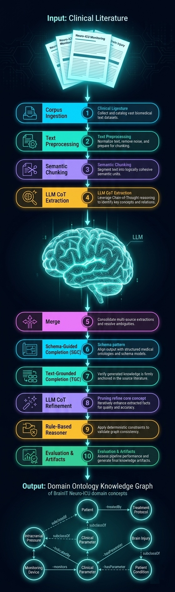

# TripleGen Pipeline

This document is the written companion to the pipeline diagram below. The diagram shows the **Schema-Completed mode**, which is the full superset — every other mode is a subset of it. Read the diagram step by step for the visual flow, and this document for additional context on each step.

---

## Pipeline Diagram

---

## Pipeline Summary

The pipeline runs in **10 numbered steps**, taking clinical literature in and producing a structured ontology out. Steps 1–5 are common to every pipeline mode; steps 6–9 are added by Schema-Completed mode; step 10 produces evaluation results and run artefacts.

---

### Step 1 — Corpus Ingestion

*Mode: All*

Paste text, upload `.txt` or `.pdf` files, select a built-in BrainIT paper from the dropdown (11 papers), or use the default paper. The corpus is stored as a snapshot inside the run directory for reproducibility.

---

### Step 2 — Text Preprocessing

*Mode: All*

Document-level normalisation that prepares raw papers for chunking:

- Strip control characters
- Citation stripping, abbreviation expansion, hyphenation repair, symbol normalisation, header/footer removal
- Document-level scope filter drops admin-heavy paragraphs and blacklisted lines

---

### Step 3 — Semantic Chunking

*Mode: All*

Documents are split into coherent chunks (target 2000 tokens, max 3200, min 400, overlap 200). Each chunk is classified by section type (high / medium / low / skip priority), and candidate domain terms are extracted from each chunk (filtered noun phrases, `max_terms=12`).

A **chunk-level scope filter** (dual-score: `admin_score` and `clinical_score`) drops administrative chunks before they reach the LLM. Clinical sections (Monitoring, ICU Management, Secondary Insults) are always kept; governance sections and reference chunks are skipped.

---

### Step 4 — LLM CoT Extraction

*Mode: All*

For each chunk that survives the scope filter, the framework assembles a prompt, calls the extraction LLM, and parses + validates the output.

**Prompt assembly.** The prompt is composed from:

- **VOCAB_AND_HINTS block** — domain class labels, typed relation labels, omit rules *(Strict+)*; NER note (ScispaCy entities filtered to domain matches) *(Guided+)*; candidate domain terms *(Guided+)*
- **System role + core constraints** — source fidelity, evidence required, hierarchy rule
- **Anti-anchoring instruction** + conservative-extraction rule
- **Output format** — strict JSON
- **Worked examples** retrieved via **MMR (λ=0.7)** with TF-IDF cosine similarity (Zero-Shot uses 0 examples; One-Shot retrieves 1 from a comprehensive pool; Few-Shot retrieves 3 per phase from dedicated class / relation / hierarchy pools)
- **Section context** — chunk section type for section-aware extraction
- **Chunk text**

The prompt section order varies by strategy:

| Strategy | Section order (top → bottom in prompt) |
|----------|----------------------------------------|
| **One-Shot** | VOCAB_AND_HINTS → SYSTEM ROLE → CORE CONSTRAINTS → Anti-anchoring → Conservative → OUTPUT FORMAT → Example (1) → Chunk text |
| **Few-Shot** | SYSTEM ROLE → CORE CONSTRAINTS → VOCAB_AND_HINTS → PHASE_INSTRUCTION → OUTPUT FORMAT → ANTI-ANCHORING → Examples (3) → Chunk text |
| **Zero-Shot** | VOCAB_AND_HINTS → SYSTEM ROLE → PRIMARY GOAL → HARD RULES → OUTPUT FORMAT → FINAL CHECK → Chunk text |

**LLM call(s) per chunk.**

| Strategy | Calls per chunk |
|----------|----------------|
| **Zero-Shot** | 1 call |
| **One-Shot** | 1 call (+1 optional hierarchy sub-call when the chunk has hierarchy cues and ≥1 allowed class) |
| **Few-Shot** | 3 calls — Phase 1 (classes) → Phase 2 (relations) → Phase 3 (hierarchy, gated by lexical cues) |

**Parse + strict evidence gating.**

- JSON parsing with truncated-response recovery (strip trailing whitespace/commas, try multiple closing sequences)
- **Strict evidence gating**: every extracted class, relation, and hierarchy edge must carry a verbatim quote from the source. Items without evidence or below the minimum length are rejected.
- Vocabulary filtering per phase output (restrict to allowed labels)
- Hierarchy filtered through `filter_hierarchy_to_lexical_cues`

---

### Step 5 — Merge

*Mode: All*

The per-chunk extractions are consolidated into a single ontology:

- Canonical alias mapping — e.g. "ICP", "mean ICP" → "Intracranial Pressure (ICP)"
- Label normalisation — singularise, hyphen collapse, title case, alias resolution
- Singular/plural deduplication by canonical key
- Relations deduped by `(label, domain, range)`; evidence and provenance merged

**Snapshot saved:** `extraction`

---

### Step 6 — Text-Grounded Completion (TGC)

*Mode: Schema-Completed*

Second-pass extraction: the LLM reviews the full document plus the current ontology to find items missed in per-chunk extraction. Uses **Chain-of-Layer** taxonomy construction for structured multi-pass review, producing hierarchy structure that flat per-chunk extraction cannot reach.

**Snapshot saved:** `after_text_grounded`

---

### Step 7 — Schema-Guided Completion (SGC)

*Mode: Schema-Completed*

Compares the merged ontology against expected schema patterns, identifies missing classes, relations, and hierarchy edges, and asks the LLM: *"Which of these missing items are supported by the corpus?"* Only corpus-evidenced items with valid domain/range are added (lenient evidence threshold; 8192 token budget).

Diagnostic artefacts: `sgc_prompt.txt`, `sgc_response.txt`, `sgc_diagnostic.json`.

**Snapshot saved:** `after_sgc`

---

### Step 8 — LLM CoT Refinement

*Mode: Schema-Completed*

A sequence of three passes that prune and refine the post-SGC ontology, before the rule-based reasoner runs:

1. **Built-in Cleanup** — 11-step deterministic cleanup: deduplicate, out-of-scope pruning, abstract/broad label pruning, class evidence pruning, dangling hierarchy/relation pruning, relation evidence pruning, hierarchy fragment pruning, axiom constraint enforcement (forbidden hierarchy pairs).
2. **Orphan Rescue** — re-checks orphan classes (no incoming/outgoing edges) against domain-scope heuristics to recover legitimate items, then re-prunes anything still out of scope.
3. **LLM Chain-of-Thought refinement** — optional CoT pass over the cleaned ontology to enhance accuracy and consistency.

**Snapshots saved (in order):** `after_cleanup` → `after_orphan_rescue` → `after_llm_refinement`

---

### Step 9 — Rule-Based Reasoner

*Mode: Schema-Completed*

Applies axiomatic schema rules to add inferred hierarchy edges where both endpoint classes already exist. Also removes orphan classes not referenced by any relation or hierarchy edge.

**Snapshot saved:** `after_rule_based`

---

### Step 10 — Evaluation & Artefacts

Output quality is assessed using a **two-stage qualitative LLM-as-judge protocol (LLMQV)**, applied at the final stage and at every intermediate snapshot for per-stage ablation.

**Stage A** classifies each extracted relation and hierarchy edge as one of:

- `accept_direct` — supported and well-formed as extracted
- `accept_indirect` — semantically valid but expressed indirectly
- `reject` — incorrect or implausible
- `revise` — needs a specific repair (passed to Stage B)

**Stage B** assigns a sub-type (4.1–4.10) to every revise verdict, capturing the concrete edit a knowledge engineer would apply (e.g. change target class, edit class name, swap subject/object, convert relation to subclass).

Verdicts are aggregated into the **Action-Weighted Quality (AWQ)** score in [0, 1], weighted by knowledge-engineer effort: `accept_direct = 1.0`, `accept_indirect = 0.75`, revise sub-types `0.25–0.8`, `reject = 0.0`.

**Artefacts written to `runs/<run_id>/`:**

| File | Contents |
|------|----------|
| `ontology.json` | Final generated ontology |
| `metrics.json` | Verdict-count distribution, mean confidence, per-stage AWQ |
| `verdicts.jsonl` / `verdicts.csv` | Per-triple judge verdicts and Stage B sub-types |
| `summary.txt` | Human-readable run summary |
| `improvement_counts.json` | Per-feature counts of items added or removed at each stage |
| `axiom_violations.json` | Constraint violation log |
| `sgc_diagnostic.json` | SGC filter stage counts |
| `prompt_chunk_NNN.txt` | Per-chunk saved prompts |
| `metadata.json` | Run configuration and code version |

---

## Pipeline Mode Coverage

| Mode | Steps active | What it adds |
|------|-------------|-------------|
| **Strict** | 1–5, 10 | Raw extraction — no vocabulary guardrails, no NER. Strict evidence gating is the only quality gate. Zero-Shot prompting only. |
| **Guided** | 1–5, 10 *(+ NER and candidate terms in step 4)* | + Vocabulary guardrails + Medical NER anchoring + candidate-term injection |
| **Schema-Completed** | 1–10 (all) | + TGC + SGC + built-in cleanup + orphan rescue + LLM CoT refinement + rule-based reasoning |

---

## Cross-Paper Ontology Engineering

Independent of the per-paper pipeline above, the **Ontology Engineering** page reconstructs a single domain ontology from the output of multiple prior runs. It runs as a four-stage workflow, with each stage decoupled from the next so downstream work can be resumed from any intermediate artefact.

### Stage 1 — Load and Merge

Prior runs are loaded; classes are deduplicated via canonical-key matching (lowercase, stripped, alias-aware) and relations by `(label, domain, range)`. Evidence is aggregated rather than discarded. The merged ontology becomes the **fixed class inventory** for Stage 3.

### Stage 2 — Semantic Clustering

Class labels and definitions are encoded with `all-MiniLM-L6-v2` and grouped via Ward's hierarchical agglomerative clustering. The optimal cluster count is selected via silhouette analysis over k = 5–25. Each cluster is sized to fit within a single LLM context window.

### Stage 3 — LLM Reconstruction

For each cluster the LLM produces **per-class OWL existential restrictions** (e.g. `ClassA SubClassOf (relation some ClassB)`) under three deliberate constraints:

- **No new classes** — the LLM may only reference classes already in the merged inventory; inferred classes are dropped post-parse.
- **Closed relation vocabulary** — allowed relation labels are self-seeded from the merged source's existing relations (preserving exact casing). Any out-of-vocabulary label is dropped post-parse.
- **Hierarchy passthrough** — the LLM is told not to emit hierarchy. Any hierarchy edges it produces are discarded; the source-seed hierarchy is authoritative.

A **source-seeded merge** prepends the original merged source ontology to the cluster fragments before final merge, so anything the LLM forgets to re-emit is rescued from the source.

### Stage 4 — Qualitative Evaluation

The reconstructed ontology is submitted to the same two-stage LLM-as-judge protocol used in Step 10 (LLMQV → AWQ). Stage 4 is decoupled from Stage 3, so the same evaluation procedure can be applied to a fresh reconstruction, a previously saved one, or any individual per-paper run loaded directly through the page's Stage-1 loader.

Run metadata (`metadata.json`) records `closed_relation_vocab`, `n_allowed_relations`, `hierarchy_from_source_only`, and `source_seeded` so reconstruction runs are fully traceable.

---

## Technology Stack

| Component | Technology |
|-----------|------------|
| Language | Python 3.11 |
| Extraction LLMs | OpenAI GPT-4o-mini, OpenAI GPT-4o, Anthropic Claude Haiku 4.5, Google Gemini 2.5 Flash, Groq Llama 3.1 8B, Hugging Face Mistral 7B, DeepSeek |
| Reasoning LLMs | OpenAI GPT-4o-mini, DeepSeek Reasoner R1 |
| Retrieval | TF-IDF + cosine similarity + MMR (λ=0.7) |
| Medical NER | ScispaCy `en_ner_bc5cdr_md` |
| Ontology serialisation | JSON (internal), OWL/RDF Turtle (output), rdflib |
| Web UI | Flask + Cytoscape.js |
| Evaluation | Two-stage LLM-as-judge protocol producing Action-Weighted Quality (AWQ) scores |

---

## Related Documents

- [project_overview.md](project_overview.md) — full methodology, research context, and feature overview
- [TripleGen_WepApp.md](TripleGen_WepApp.md) — web interface walkthrough with screenshots
